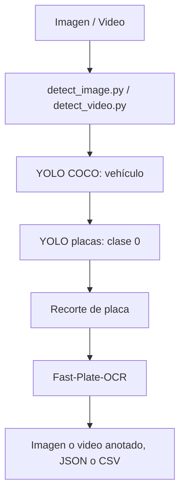
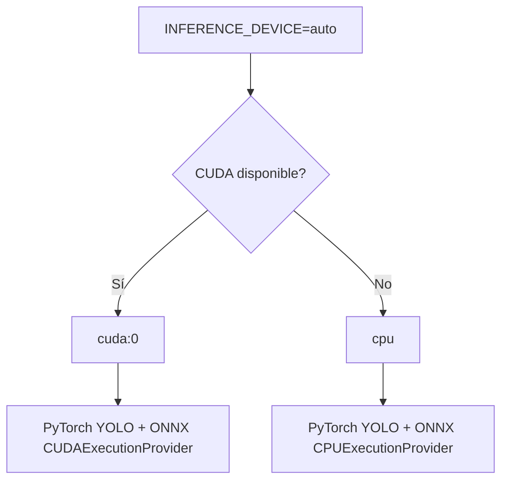

# License Plate Recognition Pipeline

Pipeline LPR para imágenes y vídeo. Detecta vehículos con YOLO COCO, busca la placa dentro de cada vehículo con un modelo YOLO especializado y la lee con Fast-Plate-OCR. Los scripts guardan la imagen anotada y resultados estructurados; en vídeo conservan el seguimiento por vehículo.

## Uso rápido

### Clonar

```bash
git clone https://github.com/JAVM11/LPR_pipeline.git
cd LPR_pipeline
```

Se requieren los pesos locales `Modelos/yolov8n.pt` (vehículos COCO) y `Modelos/plate.pt` (placa, clase `0`).

### GPU NVIDIA — recomendado

```bash
docker compose -f docker-compose.yml -f docker-compose.gpu.yml build
docker compose -f docker-compose.yml -f docker-compose.gpu.yml run --rm lpr
```

### CPU o equipo sin NVIDIA

```bash
docker compose build
docker compose run --rm lpr
```

Ambos comandos procesan la imagen incluida `assets/free-photo-of-calle-vehiculo-coche-deportivo-urbano.jpg`. Los resultados quedan en `results/docker/`.

## Probar una imagen

### Opción A — imagen incluida

```bash
docker compose -f docker-compose.yml -f docker-compose.gpu.yml run --rm lpr --input /assets/free-photo-of-calle-vehiculo-coche-deportivo-urbano.jpg
```

Para CPU, quite `-f docker-compose.gpu.yml` del comando. La salida contiene:

- `result_<imagen>.jpg`: imagen anotada.
- `result_<imagen>.json`: detecciones, coordenadas y OCR.

La prueba GPU validada sobre esta imagen detectó el vehículo y la placa, y obtuvo `7507LSV`.

### Opción B — imagen propia

Coloque la imagen en `./inputs/` y ejecute desde la raíz del repositorio:

```bash
LPR_INPUT_DIR=./inputs docker compose -f docker-compose.yml -f docker-compose.gpu.yml run --rm lpr --input /inputs/mi_imagen.jpg
```

En PowerShell:

```powershell
$env:LPR_INPUT_DIR = './inputs'
docker compose -f docker-compose.yml -f docker-compose.gpu.yml run --rm lpr --input /inputs/mi_imagen.jpg
```

Consulte `results/docker/`, o cambie la carpeta persistente con `LPR_RESULTS_DIR`.

## Probar un video

Coloque `mi_video.mp4` en `./inputs/`. El script de vídeo genera el vídeo anotado y `plates.csv`; a diferencia de imagen, mantiene IDs de seguimiento entre frames.

```bash
LPR_INPUT_DIR=./inputs docker compose -f docker-compose.yml -f docker-compose.gpu.yml run --rm --entrypoint python lpr -B scripts/detect_video.py --input /inputs/mi_video.mp4 --output /results/mi_video_anotado.mp4 --vehicle-model /models/yolov8n.pt --plate-model /models/placa2.pt --ocr-model cct-s-v2-global-model --device auto --conf 0.5
```

Para CPU, use sólo `docker-compose.yml`. En PowerShell, defina antes `$env:LPR_INPUT_DIR = './inputs'`.

## Arquitectura



La misma aplicación y la misma imagen Docker resuelven el dispositivo una sola vez:



| Valor | Comportamiento |
| --- | --- |
| `auto` | Usa CUDA cuando está disponible; si no, CPU. |
| `cuda` | Exige CUDA y falla claramente si no está disponible. |
| `cpu` | Fuerza CPU aunque exista GPU. |

Puede fijarlo en ejecución, por ejemplo: `INFERENCE_DEVICE=cpu docker compose run --rm lpr`.

En una ejecución GPU se verán mensajes como:

```text
Inference device: CUDA
GPU: NVIDIA ...
ONNX active provider: CUDAExecutionProvider
Detecciones encontradas: 1
... Placa: 7507LSV
Resultados guardados en: /results
```

## Resultados visuales

### Procesamiento de imagen

<!-- Agregar captura en docs/images/image-demo.png -->

### Procesamiento de video

<!-- Agregar captura en docs/images/video-demo.png -->

## Docker: GPU y CPU

`docker-compose.yml` contiene la configuración común y funciona sin GPU. `docker-compose.gpu.yml` es un override que añade acceso NVIDIA; no duplica el pipeline.

```text
Compose base
  ├── CPU
  └── Override GPU → NVIDIA / CUDA
```

## Requisitos

**CPU:** Docker y Docker Compose.

**GPU NVIDIA:** Docker y Docker Compose, driver NVIDIA compatible y soporte NVIDIA para Docker. En Windows, Docker Desktop con WSL2 debe tener integración GPU habilitada. El contenedor incluye las dependencias CUDA de la aplicación.

## Estructura

```text
LPR_pipeline/
├── src/                         # Pipeline, detectores y OCR
├── scripts/                     # Entradas para imagen y vídeo
├── Modelos/                     # Pesos YOLO locales
├── assets/                      # Imágenes de ejemplo
├── results/                     # Salida persistente de Docker
├── Dockerfile
├── docker-compose.yml           # Configuración base
├── docker-compose.gpu.yml       # Acceso NVIDIA
├── requirements-docker.lock
└── README.md
```

## Configuración

| Variable | Default | Descripción |
| --- | --- | --- |
| `INFERENCE_DEVICE` | `auto` | Selección de CPU/GPU. |
| `LPR_INPUT_DIR` | `./assets` | Directorio montado en `/inputs`. |
| `LPR_RESULTS_DIR` | `./results/docker` | Directorio montado en `/results`. |

## Problemas comunes

### Docker no detecta NVIDIA

Ejecute con `docker-compose.gpu.yml` y compruebe el driver NVIDIA y el soporte GPU de Docker/WSL2.

### `CUDA available: False`

Con `INFERENCE_DEVICE=auto` el pipeline usa CPU automáticamente.

### Quiero forzar CPU o exigir GPU

Use `INFERENCE_DEVICE=cpu` o `INFERENCE_DEVICE=cuda`, respectivamente. El segundo modo falla si CUDA no está disponible.

### No aparecen resultados

Revise `results/docker/`, o la ruta definida por `LPR_RESULTS_DIR`.
